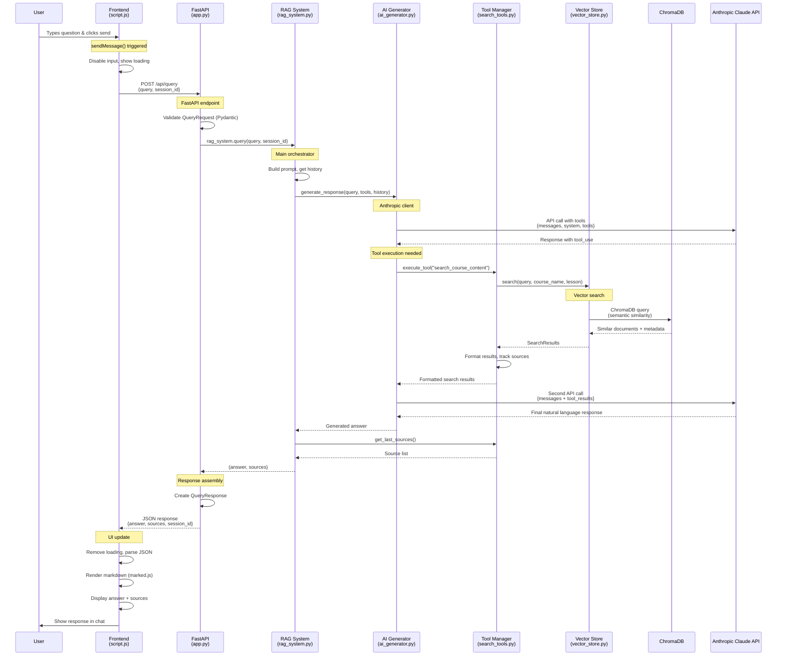

# RAG System Request Flow Diagram

## Key Technologies at Each Layer

### Frontend Layer

- **JavaScript ES6+**: Event handling, DOM manipulation
- **Fetch API**: HTTP requests
- **Marked.js**: Markdown to HTML conversion

### API Layer  

- **FastAPI**: Web framework with automatic validation
- **Pydantic**: Request/response models
- **CORS Middleware**: Cross-origin support

### Processing Layer

- **RAG System**: Orchestrates components
- **Session Manager**: Conversation history
- **Tool Manager**: Plugin architecture

### AI Layer

- **Anthropic Client**: Claude API integration  
- **Tool Calling**: Function calling capability
- **System Prompts**: Specialized instructions

### Search Layer

- **Vector Store**: Semantic search orchestration
- **ChromaDB**: Vector database with persistence
- **Sentence Transformers**: Text embeddings

## Data Flow Summary

1. **User Input** → Frontend JavaScript
2. **HTTP Request** → FastAPI endpoint  
3. **Query Processing** → RAG System orchestration
4. **AI Generation** → Claude with tool access
5. **Vector Search** → ChromaDB semantic similarity
6. **Result Synthesis** → Claude final response
7. **JSON Response** → Frontend rendering
8. **UI Update** → User sees answer + sources
